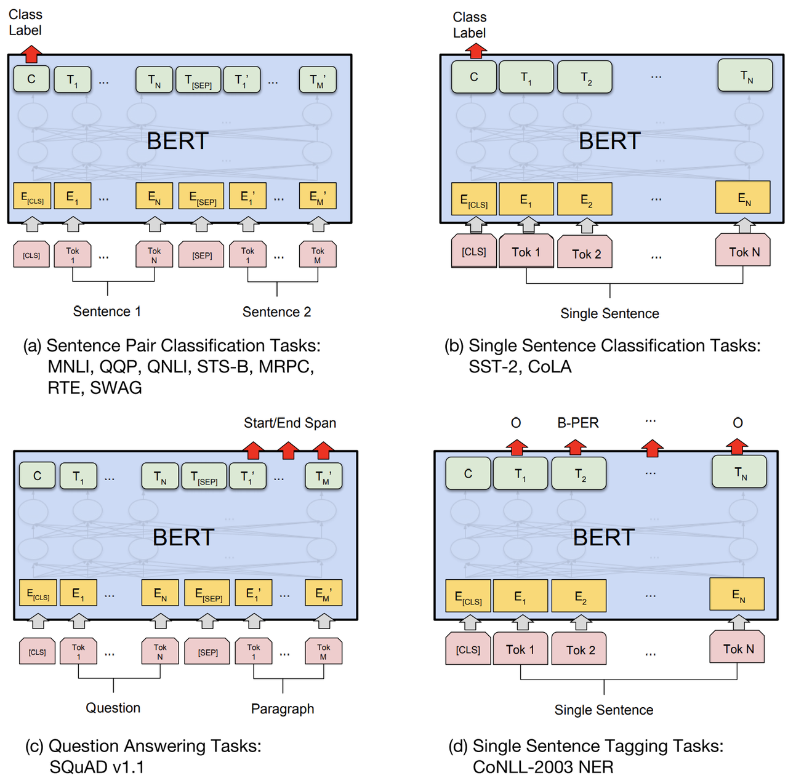

<head>
    <link rel="stylesheet" href="https://cdn.jsdelivr.net/npm/katex@0.15.1/dist/katex.min.css"
        integrity="sha384-R4558gYOUz8mP9YWpZJjofhk+zx0AS11p36HnD2ZKj/6JR5z27gSSULCNHIRReVs" crossorigin="anonymous">
    <script defer src="https://cdn.jsdelivr.net/npm/katex@0.15.1/dist/katex.min.js"
        integrity="sha384-z1fJDqw8ZApjGO3/unPWUPsIymfsJmyrDVWC8Tv/a1HeOtGmkwNd/7xUS0Xcnvsx"
        crossorigin="anonymous"></script>
    <script defer src="https://cdn.jsdelivr.net/npm/katex@0.15.1/dist/contrib/auto-render.min.js"
        integrity="sha384-+XBljXPPiv+OzfbB3cVmLHf4hdUFHlWNZN5spNQ7rmHTXpd7WvJum6fIACpNNfIR"
        crossorigin="anonymous"></script>
    <script>
        document.addEventListener("DOMContentLoaded", function () {
            renderMathInElement(document.body, {
                // customised options
                // • auto-render specific keys, e.g.:
                delimiters: [
                    { left: '$$', right: '$$', display: true },
                    { left: '$', right: '$', display: false },
                    { left: '\\(', right: '\\)', display: false },
                    { left: '\\[', right: '\\]', display: true }
                ],
                // • rendering keys, e.g.:
                throwOnError: false
            });
        });
    </script>
</head>

# BERT

近年来的工作显示，预训练可以有效提高各项NLP任务的成绩，把预训练表征应用在下游任务上有两种方法：一种是基于特征，类似于ELMo这种杀鸡取卵式；另一种是微调，比如GPT，在下游任务上引入很少的任务特定的参数。二者都包含一个预训练模型，并且预训练目标都一样，区别在于面对下游任务时，ELMo只提供词表征，而模型需要根据下游任务确定；GPT则是保留预训练模型，然后在此基础上引入少量的网络层，微调时将调整模型所有参数。

Jacob等人认为当前语言模型（如GPT）受限于单向建模，由此提出一个深度的双向语言模型BERT. 其贡献有两点：

- 在GPT的基础上，提出双向语言模型，即Masked Language Modeling, MLM
- 提出NSP预训练任务，学习句子对的表征。

## 模型架构

模型方面，BERT由若干层Transformer Encoder层组成，参考[博客Transformer](Transformer).

输入和输出方面，BERT的输入有两种形式，一种是单句子，另一种是句子对。对于输入的任意句子，BERT首先通过BPE字词算法将句子转化成token sequence[^subword]。词典大小为21228

随后，BERT将根据token sequence生成token id、position id和token type id，并生成三种嵌入。以单句子`I like playing soccer`和句子对`I like playing soccer，我喜欢踢足球`两种输入为例，得到的id分别为：

```
token:         [CLS]  i  like  play  ##ing  soc  ##cer  [SEP]
token id:       101  151 8993  8942  8221  11405 10326   102
position id:     0    1   2     3     4      5     6      7
token type id:   0    0   0     0     0      0     0      0


token:          [CLS]  i  like  play  ##ing  soc  ##cer  [SEP]   我     喜    欢    踢     足    球 [SEP]
token id:        101  151 8993  8942  8221  11405 10326   102  2769  1599   3614  6677  6639  4413   102
position id:      0    1   2     3     4      5     6      7      8     9     10    11    12    13    14
token type id:    0    0   0     0     0      0     0      0      1     1      1     1     1     1     1
```

- 引入[CLS]和[SEP]两个特殊符号将两种输入形式统一起来：[CLS]总是位于句子首位，用于表达句子的整体语义，[SEP]为分隔符；
- 引入token type id来区分当前token所属的句子id；
- BERT的position embedding不再是固定的正弦余弦曲线，而是通过学习生成；

最终，将得到的token embedding、position embedding和token type embedding相加，即为BERT最终的输入。

## 预训练任务

BERT的预训练任务有Masked Language Modeling(MLM)和Next Sentence Prediction(NSP)两个。

### 3.1 MLM

BERT随机用[MASK]字符来覆盖token，然后通过上下文来预测被遮掩的字符的真实id，这样既可以避免"偷窥"还能起到预训练"语言模型"的作用。具体地，BERT随机选择15%的token来预测，一旦第i个token被选中，有三种处理结果：

- 80%的概率用[MASK]替换
- 10%的概率用随机token替换
- 10%的概率不替换

无论采取那种处理，都通过交叉熵损失来预测。

### 3.2 NSP

BERT在[CLS]字符处，预测输入的句子对是否相邻，这个预训练任务主要的目的是学习句子间的语义。实际操作时，将生成等量的正负句子对样例(分别对应标签IsNext和NotNext)数据以供训练。

### 3.3 预训练语料

预训练的语料来自于BookCorpus和English Wikipedia（只抽取文本文章，忽略列表、表格和标题）。这里作者指出：为了抽取出连续的长句子，使用文档语料而不是打乱的句子语料很关键。


其他预训练超参数
- batch_size: 256
- max_seq_len: 512（前90% steps使用128的序列长度，后10% steps使用512的序列长度）
- epochs: 40
- 优化器: Adam, $\beta_1=0.9$，$\beta_2 = 0.999$，L2 weight decay = 0.01
- 学习率: 1e-4，学习率线性衰减
- 激活函数: gelu (same as GPT)
- 正则: 所有层使用dropout=0.1
- 损失值: mean masked LM likelihood + mean next sentence prediction likelihood

## 微调任务

微调的方式和GPT一样，最大化减少task-specific参数。



微调超参数和预训练一致，除了：

- batch_size: 16, 32
- learning_rate: 5e-5, 3e-5, 2e-5
- number of epochs: 2, 3, 4

## 实验结果

BERT刷新了11项NLP任务的成绩，其中8个glue任务、SQuAD 1/SQuAD 2和SWAG，实验结果对比如下：

## 总结

BERT的核心：
- 输入mask机制
- 三层embedding输入
- 两个预训练任务：mlm、nsp
- 微调


[^subword]: 详见[字词算法](subword)
